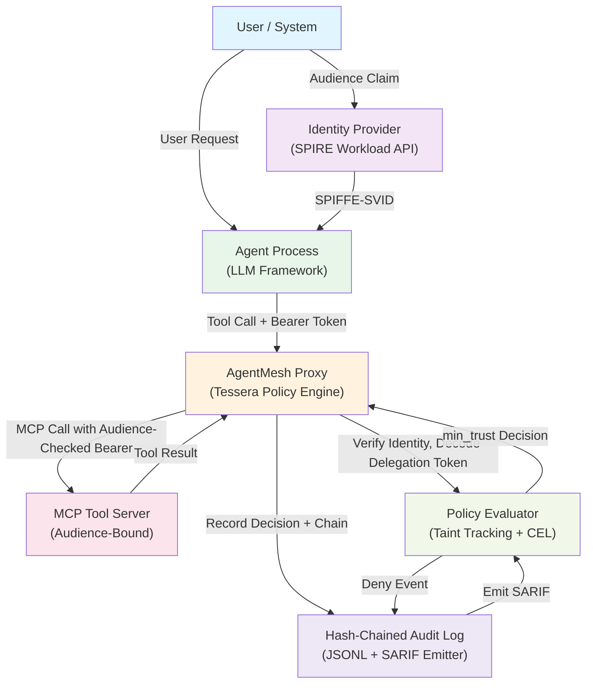

# NCCoE AI Agent Identity and Authorization Reference Architecture

This document describes the reference architecture Tessera contributes to the NCCoE AI Agent Identity and Authorization practice guide.

## Architecture Diagram



## Component Breakdown

### 1. Identity Provider (SPIRE)

**Role:** Issues SPIFFE service identity (SVID) to the agent process.

**Responsibilities:**
- Attest agent workload identity at startup via local node agent
- Issue short-lived X.509 SVID (5-minute default TTL) with spiffe:// subject
- Support proof-of-possession (PoP) binding via JWK thumbprint in cnf.jkt

**Tessera Integration:**
- `tessera.identity.WorkloadIdentity` wraps the SVID subject
- `tessera.identity.WorkloadIdentityToken` maps to WIMSE WIT envelope
- `tessera.spire.SpireClient` connects to SPIRE Workload API

### 2. Agent Process (LLM Framework)

**Role:** Receives user request, calls tools, records delegation intent.

**Responsibilities:**
- Obtain SPIFFE-SVID from local SPIRE node agent
- Sign delegation token with user consent (scopes: tool names, data sensitivity ceiling)
- Pass signed token + bearer header to AgentMesh proxy

**Tessera Integration:**
- `tessera.delegation.DelegationToken` encodes user intent
- `tessera.delegation.sign_delegation` produces HMAC-signed canonical form
- `tessera.signing.JWTSigner` produces RFC 8705 PoP for bearer protocol

### 3. AgentMesh Proxy (Tessera Policy Engine)

**Role:** Intercepts tool calls, enforces trust-based policy, records outcomes.

**Responsibilities:**
- Verify inbound bearer token and delegation token signature
- Extract context segments with trust labels
- Evaluate policy against context minimum trust level
- Emit SecurityEvent (allow/deny) with NIST control enrichment
- Forward authorized calls to MCP tool server

**Tessera Integration:**
- `tessera.policy.Policy.evaluate(tool_name, context)` enforces min_trust
- `tessera.labels.TrustLabel` carries origin, principal, trust level (0-200)
- `tessera.context.make_segment` wraps untrusted content with labels
- `tessera.compliance.NIST_CONTROLS` enriches each event

### 4. Policy Evaluator (CEL + Taint Tracking)

**Role:** Computes min(trust_level) across context segments; applies CEL deny rules.

**Responsibilities:**
- Maintain taint at the minimum trust level observed
- Evaluate CEL expressions against (tool, min_trust, tool_requirement) tuple
- Emit POLICY_DENY when trust level falls below tool requirement

**Tessera Integration:**
- `tessera.policy.Context` holds segments + min_trust computation
- `tessera.cel_engine.Evaluator` runs CEL expressions (RFC 2144)
- `tessera.taint.TaintTracker` maintains label recovery state

### 5. MCP Tool Server (Audience-Bound)

**Role:** Receives delegated tool calls; verifies audience binding.

**Responsibilities:**
- Accept MCP call with bearer token in Authorization header
- Verify token audience matches tool's registered audience (RFC 8707)
- Execute tool; return result to proxy

**Tessera Integration:**
- `tessera.mcp.oauth.OAuthBearerVerifier` checks audience binding
- Tool result passes through `tessera.mcp._default_extract` (binary replacement)

### 6. Hash-Chained Audit Log (JSONL + SARIF Emitter)

**Role:** Durable, tamper-evident record of all policy decisions.

**Responsibilities:**
- Append SecurityEvent to JSONL file with prev_hash chain
- Compute SHA-256 hash of canonical JSON (deterministic key order)
- Emit SARIF report of deny events for external SIEM ingestion
- Support hash-chain verification without signing key

**Tessera Integration:**
- `tessera.audit_log.JSONLHashchainSink` writes durable events
- `tessera.events.SecurityEvent` carries decision + detail envelope
- `tessera.compliance.NIST_CONTROLS` and `tessera.compliance.CWE_CODES` map events to standards

## Canonical Data Flow: Agent Calls Tool with Delegated Authority

```
Step 1: User Request
    User sends request to agent with scope: ["write:datastore", "read:metrics"]
    User's email: user@example.com

Step 2: SPIRE Identity Binding
    Agent process calls local SPIRE node agent
    SPIRE returns X.509 SVID: spiffe://cluster.local/ns/default/sa/agent-01
    SVID valid for 5 minutes (TTL)

Step 3: Delegation Token Signed
    Agent process creates DelegationToken:
        subject: "user@example.com"
        delegate: "spiffe://cluster.local/ns/default/sa/agent-01"
        audience: "https://datastore.internal"
        authorized_actions: ["write:datastore", "read:metrics"]
        mcp_audiences: frozenset(["datastore-mcp"])
        sensitivity_ceiling: SecrecyLevel.INTERNAL
    Agent HMAC-signs with shared secret (v0) or JWT-signs with private key (v0.13+)
    Signature expires in 5 minutes

Step 4: Bearer Token Issued
    Agent process wraps SVID in JWT (typ: wit+jwt) with PoP binding
    JWT includes:
        iss: "spiffe://cluster.local/ns/default/sa/agent-01"
        aud: "https://datastore.internal"
        cnf.jkt: base64url(sha256(SVID public key))
    Bearer token used in Authorization: Bearer <JWT>

Step 5: MCP Tool Call Reaches AgentMesh Proxy
    Request arrives with:
        - Authorization: Bearer <JWT>
        - X-Delegation-Token: <signed-token>
        - Tool: write_datastore
        - Context segments: [user prompt, retrieval result, system context]

Step 6: Proxy Verifies Identity and Delegation
    Proxy extracts bearer token (JWT)
    Proxy verifies JWT signature (JWKS if SPIRE-issued)
    Proxy extracts delegation token header
    Proxy verifies delegation signature
    Proxy checks delegation expiry
    Proxy binds audience from bearer token to authorized_actions

Step 7: Context Tainting and Label Inspection
    Proxy examines each context segment:
        - User prompt: label TrustLevel.USER (100)
        - System context: label TrustLevel.SYSTEM (200)
        - Retrieval result (from URL source): label TrustLevel.TOOL (50)
    Proxy computes min_trust = min(100, 200, 50) = 50 (TOOL)

Step 8: Policy Decision
    Proxy loads policy: ToolRequirement for write_datastore
        required_trust_level: 100  // USER or above
        allowed_principals: ["user@example.com", "trusted-agent@example.com"]
    Proxy evaluates: min_trust (50) < required_trust_level (100) -> DENY
    Proxy emits SecurityEvent(kind=POLICY_DENY, detail=...)

Step 9: Audit Record
    Proxy appends to hash-chained log:
        {
            "seq": 42,
            "timestamp": "2026-04-25T10:30:00Z",
            "kind": "POLICY_DENY",
            "decision": "DENY",
            "tool_name": "write_datastore",
            "min_trust": 50,
            "required_trust": 100,
            "nist_controls": ["AC-4", "SI-10", "SC-7"],
            "cwe_codes": ["CWE-20"],
            "prev_hash": "...",
            "hash": "..."
        }

Step 10: Response
    Proxy returns 403 Forbidden to agent
    Agent receives denial; may retry with elevated scopes or request user approval
```

## Trust Boundaries and Data Inputs

### Boundary 1: User-Provided Content (TrustLevel.USER = 100)

**Input sources:**
- Direct user prompt
- User-approved file uploads
- User-initiated web searches

**Handling:**
- Labeled with TrustLevel.USER
- May invoke most tools if policy permits
- Marked with principal = authenticated user email

### Boundary 2: Agent-Executed Retrieval (TrustLevel.TOOL = 50)

**Input sources:**
- Web content from user-specified URLs (SSRF-checked)
- Database queries executed by prior tool calls
- External API responses

**Handling:**
- Labeled with TrustLevel.TOOL
- Cannot invoke sensitive tools (e.g., write_datastore) without elevation
- Marked with principal = tool name / service account

### Boundary 3: System-Generated Content (TrustLevel.SYSTEM = 200)

**Input sources:**
- Agent framework configuration
- System prompts (hardcoded in deployment)
- Pre-vetted tool schemas and documentation

**Handling:**
- Labeled with TrustLevel.SYSTEM
- May invoke privileged tools
- Marked with principal = system / framework

### Boundary 4: Untrusted Segments (TrustLevel.UNTRUSTED = 0)

**Input sources:**
- Redacted content (marked [REDACTED] by tessera.redaction)
- Segments failing label verification
- Segments from revoked signers

**Handling:**
- Automatically blocks all tool calls
- Proxy denies immediately; no policy evaluation needed
- Triggers LABEL_VERIFY_FAILURE event

## Tessera Primitives Reference

### Delegation and Identity
- `tessera.delegation.DelegationToken`: subject -> delegate -> audience binding
- `tessera.delegation.sign_delegation`: HMAC-SHA256 or JWT signature
- `tessera.delegation.verify_delegation`: expiry + signature validation
- `tessera.identity.WorkloadIdentity`: SPIFFE SVID subject + assertions

### Context and Taint
- `tessera.context.make_segment`: wraps text + creates TrustLabel
- `tessera.context.Context`: holds segments + min_trust computation
- `tessera.labels.TrustLabel`: origin, principal, trust_level, signature

### Policy Evaluation
- `tessera.policy.Policy`: evaluates (tool, context) -> Decision
- `tessera.policy.Decision`: ALLOW, DENY, or REQUIRE_APPROVAL
- `tessera.policy.ToolRequirement`: required_trust, allowed_principals, constraints
- `tessera.cel_engine.Evaluator`: RFC 2144 expression evaluation

### MCP Integration
- `tessera.mcp.oauth.OAuthBearerVerifier`: audience + expiry validation
- `tessera.mcp._default_extract`: replaces binary content with marker
- `tessera.mcp.InterceptedMCPServer`: wraps MCP server with label injection

### Audit and Compliance
- `tessera.audit_log.JSONLHashchainSink`: durable tamper-evident record
- `tessera.events.SecurityEvent`: kind, decision, detail + timestamp
- `tessera.compliance.NIST_CONTROLS`: map event kind to NIST SP 800-53 controls
- `tessera.compliance.CWE_CODES`: map event kind to MITRE CWE IDs

## References

- NIST SP 800-63-3: Authentication and Lifecycle Management
- NIST SP 800-53 Rev. 5: Security and Privacy Controls
- RFC 8707: OIDC Authorization Server Metadata
- RFC 8705: OAuth 2.0 Proof-Key-Code Exchange (PKCE)
- RFC 2144: The CAST-128 Encryption Algorithm (CEL foundation)
- SPIFFE Specification: https://spiffe.io/docs/latest/spiffe-about/overview/
- WIMSE Working Group: draft-ietf-wimse-workload-identity-bcp, draft-klrc-aiagent-auth
